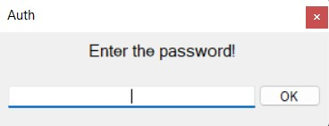
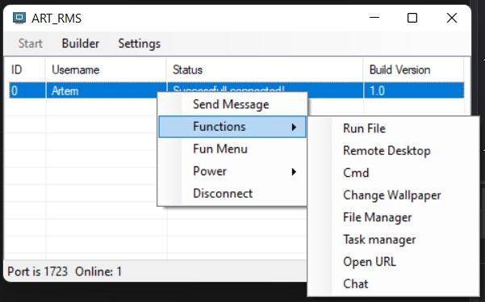
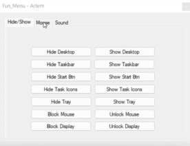
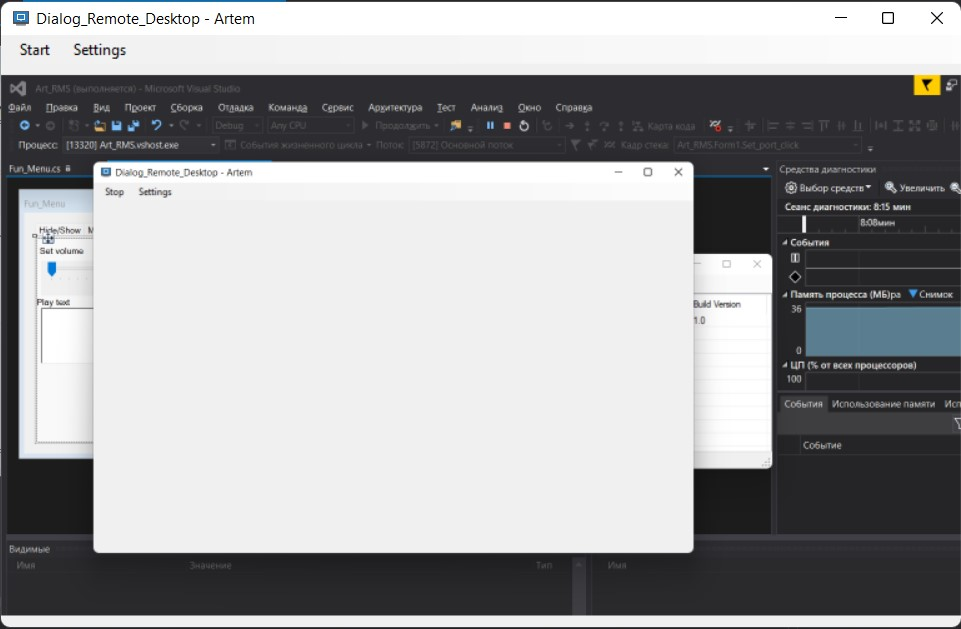
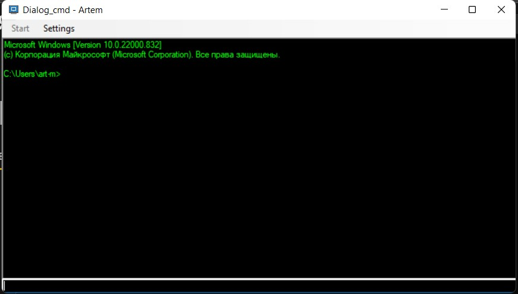
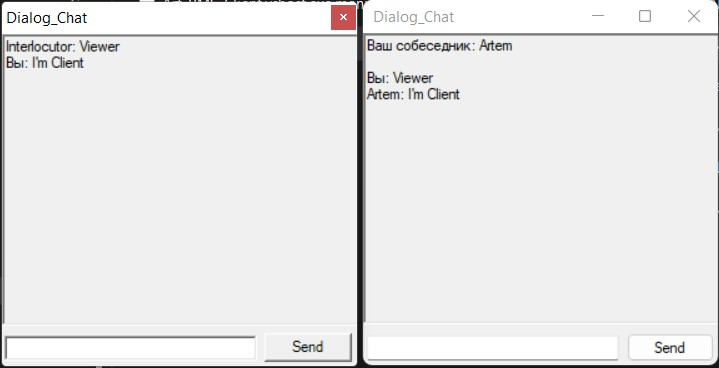

# ART RMS VIEWER

Данное приложение было разработано мной в процессе обучения программирования на языке c#.
Это приложение является серверной стороной удаленного доступа, т.е. управляющей.
___

___Запуск проекта___
* Инсталировать Visual studio c# и Net Framework 4.7.2 и выше
* Открыть в среде разрабоки Visual studio файл решения "Art_RMS.sln"
* Для запуска необходим пароль (стандарный: Test), его возможно изменить в файле "Pass.cs" (тип пароля: md5 hash)

___Возможности___
* Настройки приложения
    * __Port__ - возможно выбрать прослушиваемый порт
    * __Top Most__ - позволяет приложению быть поверх всех окон
    * __Builder__ - позволяет скомпилировать клиентский файл, с настройкой ip/dns и port, а так же пункт добавления в автозагрузку приложения.
* Функции
    * __Send message__ - позволяет отправить всплывающее окно с сообщением
    * __Run File__ - позволяет отправить и запустить любой локальный файл, а так же файл по ссылке
    * __Remote desktop__ - Позволяет просматривать экран пользователя с настройкой fps
    * __Cmd__ - Дублирование командной стрки (на выбор: cmd или PowerShell)
    * __Change Wallpaper__ - Смена обоев рабочего стола на любую картинку 
    * __File Manager__ - Файловый менеджер с возможностью обычного/скрытого запуска, скачивания и удаления любого файла
    * __Task Manager__ - Удаленный диспетчер задач, с возможностью закрытия/блокировкий процесса приложения.
    * __Open url__ - Открытие в браузере url ссылки
    * __Chat__ - Онлайн чат с пользователем. Пользователь не может его закрыть. 
    * __Fun Menu__ - Меню с развлекательными функциями
        * __Hide/Show Desktop__ - Скрытие/показ рабочего стола
        * __Hide/Show Taskbar__ - Скрытие/показ панели задач
        * __Hide/Show Start button__ - Скрытие/показ кнопки "Пуск"
        * __Hide/Show Task icons__ - Скрытие/показ иконок на панели задач
        * __Hide/Show Tray__ - Скрытие/показ трея
        * __Block/Unlock Mouse__ - Блокировка/Разблокировка мыши
        * __Block/Unlock Display__ - Блокировка/Разблокировка дисплея пк
        * __Mouse Settiongs__ - настройки параметров мыши
            * __Speed cursor__ - изменение скорости мыши
            * __Speed double click__ - изменение скорости срабатывания двойного клика по мышки
            * __Mouse track__ - задержка показа курсора мыши
            * __Mouse scroll__ - изменеие скорости скролла мыши
        * __Sound Settings__ - настройки звука
            * __Set volume__ - Изменение громкости пк
            * __Play text__ - Воспроизведение текста голосом

    * __Power__ - Управление питанием компьютера пользователя
        * __Sleep PC__ - Перевести компьютер в режим сна
        * __LogOut PC__ - Выйти из пользователя системы пк
___

__[Видеодемонстрация работы приложения](https://youtu.be/tlhUKVFrbMk)__

_Нажми для просмотра_ 👆

---

___Скриншоты___

Окно ввода пароля
 

Главное окно приложения
 

Меню с развлекательными функциями
 

Окно просмотра экрана
 

Удаленная консоль cmd
 

Файловый менеджер
 

Чат
 

